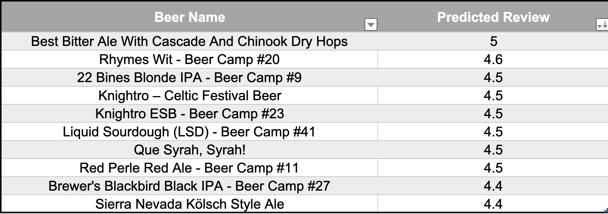
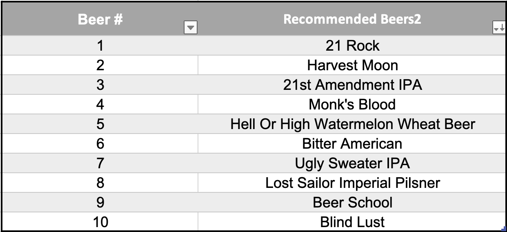
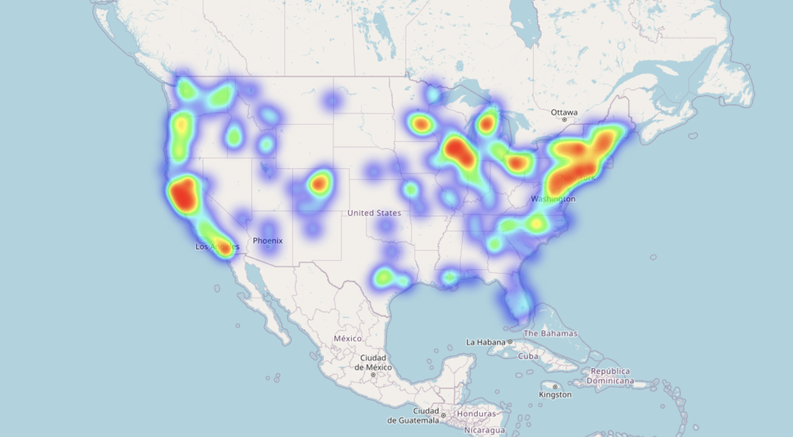
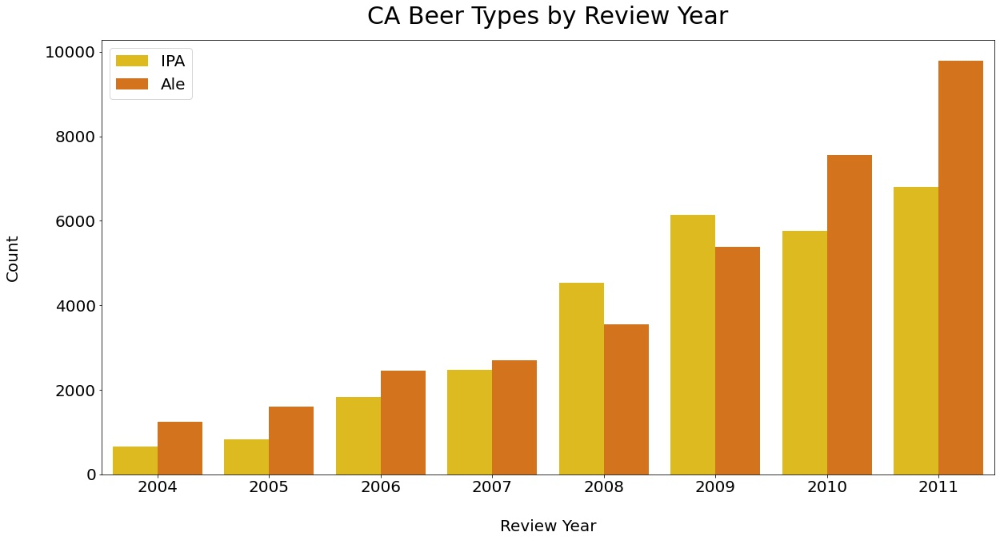
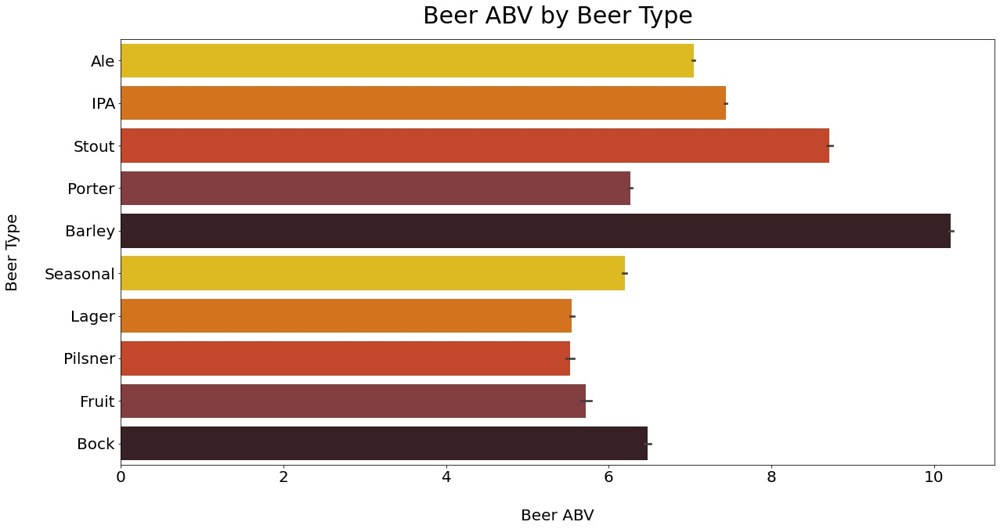

<center>
    <h1> 
        Tap into Your Taste: A Beer Recommendation System
    </h1>
</center>

### <i> Performed using multiple machine learning models and filtering techniques to accurately predict the overall rating of a beer. The Focus of this project is to create a well-established recommendation system that can predict a user's preferences using review data as well as beer data.
</i> 

#### Date: April 21, 2023
#### Author: [Sean Conlon](https://www.linkedin.com/in/seanconlon29/)

<br>

<figure>
    <p align="center">
    
    </p>
</figure>

## Table of Contents

- [Introduction](#introduction)

- [Data Cleaning](#data-cleaning)
- [Modeling](#modeling)
- [Visualization](#visualization)
- [Conclusion](#conclusion)
- [Repository Structure](#repository-structure)

## Introduction

This project was created through a culmination of the skills I have learned in the Data Science program at Flatiron School. Using datasets from the links provided I discovered a dataset containing breweries across the United States [Brewery Dataset Here](https://www.kaggle.com/code/stansilas/mapping-brewery-pubs-across-us-states/input) as well as a dataset containing over 1.5 million reviews of beers [Review Dataset Here](https://www.kaggle.com/datasets/thedevastator/1-5-million-beer-reviews-from-beer-advocate). I merged the two datasets together creating a beer_df. This was then used to create a beer recommender system using multiple machine learning models and filtering techniques. The resulting dataset withheld approximately 160,000 reviews.

## Business Problem

Many breweries that open end up ultimately failing due to their lack of communication with their consumers. This is a large issue with most businesses that open and is the leading cause of 85% of businesses closing. Each brewery that opens should adapt their business to using a recommendation system to not only help the brewery decide which beers generate more business, but also provide users with some options and opportunities to try the assortment of beers types. 

<br>

## Data Cleaning
Data cleaning was performed using the following steps:
1. Merging the two datasets into one dataframe labeled as beer_df.
2. Only keeping the top 50 breweries within the United States, to reduce the size of the dataset and increase the accuracy of the models. 
3. Removed all rows that contained less than 5000 entires per year, as it helpped the recommendation systems accuracy.
4. Removing any missing, unneeded duplicate values as well as outliers unnecessary for the analysis.
5. Feature engineering of columns to create new features that would be useful for the analysis as well as data visualization.

<br>

## Modeling
All models performed were using the surprise package and model tuning considering GridSearchCV as well as RandomizedSearchCV. Each model has an accuracy score that is sufficient enough to be less than half a rate off from the actual rating. These models include the Collaborative Model which prioritizes the users reviews and the Item-Based Model which prioritizes each feature that was rated. They were then combined into an Ensemble Model to accurately predict a beer's alcohol by volume (ABV) based on the brewery the beer was from. The last model created was Location-Based which takes advantage of the latitude and longitude coordinates to provide the necessary recommentations. 

#### Collaborative Model
This model was created in order to predict a user's rating based off of similar users ratings of certain beers. Using this information it will then provide an accurate list of 5 beers that the user will most likely enjoy. The recommendations created were for not only recommending beers, but also breweries that produce similar beers as to the ones highly-rated. 

<figure>
    <p align="center">
    
    </p>
</figure>

<br> 

#### Content-Based Model
As a Content-based model, this was created in order to see how a user will rate a beer based on the alcohol percentage. By many of those who avidly drink beers, they consider beers with a high to very-high alcohol percentage to be of bitter-taste and flavorless resulting in a low rating for most. Each beers alcohol percentage directly correlates to the beers types. For example, a beer with a high alcohol percentage is most likely a lager, while a beer with a low alcohol percentage is most likely a stout. 

<figure>
    <p align="center">
    
    </p>
</figure>

<br> 

#### Ensemble Model
As a bonus model, this ensemble was created to correctly predict what a users preference would be, there must be certain features of the beers within the dataset. Luckily there were reviews on certain features of each beer rating. These included:
- Aroma
    - The smell of the beer, rated from good to bad. 
- Appearance
    - The look of the beer, taking into account the coloration as well as the label.
- Taste
    - The flavoring of the beer.
- Palate
    - This is where the carbonation, mouthfeel, alcohol profile and texture really come in.

<p>
    insert code snip of model with recommendations for user
</p> 

<br>

#### Location-Based Model
Considering the dataset includes information about the breweries, but also their locations. I felt the need to take advantage of the coordinates provided in order to give a great recommendation not only based on beers. The model was created using help from outside sources, given that I had no prior knowledge of the haversine formula. This formula combined with the coordinates as well as some functions creates a wonderful recommendation for each user.

Each user will not only be able to see the nearest breweries based on their own coordinates, but also each breweries top 5 rated beers in order to help the user decide which brewery they would prefer. 

<figure>
    <p align="center">
    
    </p>
</figure>

<br>

## Visualization
The models made were created for the recommendation engine, but in order to see the data we need to visualize our findings. The following visualizations were interesting parts of the analysis in which I came across during the modeling process. 

<figure>
    <p align="center">
    
    </p>
</figure>

This map contains all breweries that were used within the dataset as a heatmap. Most of them are located within California. 

<figure>
    <p align="center">
    
    </p>
</figure>

Being that California had a large percentage of the data, they greatly influenced the recommendation system to recommend users IPAs as well as Ales. 

- IPA beers are actually India Pale Ales, but they are within their own beer type as they are largely different compared to other Ales. 

- Ale's are of all different types such as brown ales, irish ales and pale ales. 


<figure>
    <p align="center">
    
    </p>
</figure>

The content-based model was created using the alcohol by volume or ABV of beer. As you can see the ABV of each beer directly correlates with their beer type. These will not be as accurate as there are over 100 different types of beer within the world. 

<br>

## Conclusion

The recommendation system will work by collecting data on the types of beers customers are buying and which ones they prefer. This data will be used to generate personalized recommendations based on their past purchases and preferences. The recommendation system can also provide customers with information on new and seasonal beers that they may be interested in trying based on their previous purchases.

The brewery can also use the recommendation system to gather insights on which beers are popular and which ones are not, allowing them to adjust their inventory and brewing process accordingly. By using the recommendation system, the brewery can provide customers with a personalized experience and build stronger relationships with their customers. This will help increase customer loyalty and ultimately lead to the success of the brewery.

Additionally, the brewery can use the recommendation system to offer promotions and discounts on beers that are recommended to customers based on their preferences. This can encourage customers to try new beers and expand their taste preferences. Overall, implementing a recommendation system can greatly benefit the brewery and its customers by improving communication, increasing customer satisfaction, and ultimately leading to a more successful business.

<br>


## Repository Structure

```
├── data                                    <- CSV data files
├── Notebooks                               <- Jupyter notebooks dedicated to data exploration and modeling
├── Models                                  <- Data files used in analysis
├── Final_Notebook                          <- Notebook containing details about analysis and models
├── Collaborative-Based_Model.ipynb         <- Narrative documentation of Collaborative analysis in Jupyter notebook
├── Item-Based_Model.ipynb                  <- Narrative documentation of Item-Based analysis in Jupyter notebook
├── Location-Based_Model.ipynb              <- Narrative documentation of Location-Based analysis in Jupyter notebook
├── README.md                               <- A Overall Summary in README form of this project
├── Presentation.pdf                        <- PDF version of project presentation
```
