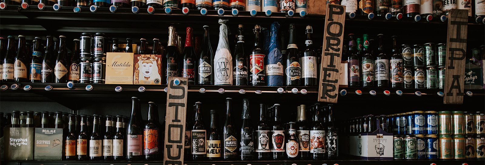

<center>
    <h1> 
        Tap into Your Taste: A Beer Recommendation System
    </h1>
</center>

<figure>
    <p align="center">
    
    </p>
</figure>

### <i> Performed using various machine learning models and filtering techniques to precisely predict the rating of a beer. The project focus is to create a well-established recommendation system that can predict a user's preferences using reviews and beer data.
</i> 

#### Date: April 21, 2023
#### Author: [Sean Conlon](https://www.linkedin.com/in/seanconlon29/)

## Table of Contents

- [Introduction](#introduction)
- [Data Cleaning](#data-cleaning)
- [Modeling](#modeling)
- [Visualization](#visualization)
- [Conclusion](#conclusion)
- [Repository Structure](#repository-structure)

## Introduction

This project was created through a combination of the skills I have learned in the Data Science program at Flatiron School. I discovered a dataset containing breweries across the United States [Here](https://www.kaggle.com/code/stansilas/mapping-brewery-pubs-across-us-states/input) as well as a dataset containing over 1.5 million reviews of beers [Here](https://www.kaggle.com/datasets/thedevastator/1-5-million-beer-reviews-from-beer-advocate). I merged the two datasets creating a beer data frame. This was then used to create a beer recommender system using multiple machine-learning models and filtering techniques. The resulting dataset included approximately 160,000 reviews.

## Business Problem

Many breweries that open end up ultimately failing due to their lack of communication with their consumers. This is a large issue with most businesses and is the leading cause of 85% of businesses closing. Each brewery that opens should adapt its business to using a recommendation system to not only help the brewery decide which beers generate more business, but also provide users with options and opportunities to try the assortment of beer types.

## Data Cleaning
Data cleaning was performed using the following steps:
1. Merging the two datasets into one data frame labeled as beer_df.
2. Only keeping the top 50 breweries within the United States, reduces the size of the dataset and increases the accuracy of the models. 
3. Removed all rows that contained less than 5000 entries per year, as it helped the recommendation systems' accuracy.
4. Removing any missing, unneeded duplicate values as well as outliers unnecessary for the analysis.
5. Feature engineering of columns to create new features that would be useful for the analysis as well as data visualization.

<br>

## Modeling
All models were performed with the surprise package and tuned using GridSearchCV and RandomizedSearchCV. These models include the Collaborative Model which prioritizes the users' reviews and the Item-Based Model which prioritizes each feature that was rated. They were then combined into an Ensemble Model to accurately predict a beer's alcohol by volume (ABV) based on the brewery the beer was from. The last model created was Location-Based which takes advantage of the latitude and longitude coordinates to provide the necessary recommendations. 

<figure>
    <p align="center">
    
    </p>
</figure>

#### Collaborative Model
This model was created to predict each users rating based on similars users ratings. This will provide an accurate list
This model was created to predict a users' rating based on similar ratings of certain beers. Using this information it will then provide an accurate list of 5 beers that the user will most likely enjoy. The recommendations created were for not only recommending beers, but also breweries that produce similar ones to those highly rated. 

REWORD COMPLETELY, AWFUL JOB SEAN

This model performed decently well compared to the RMSE and MAE scores of the baseline which uses the NormalPredictor algorithm. It was then tested using multiple algoritms such as SVD and KNNBasic, along with parameter tuning of the model. Overall, the model performed pretty well with an RMSE and MAE of 0.3 meaning the accuracy performed was approximately 70%. 

<figure>
    <p align="center">
    
    </p>
</figure>

<br> 

#### Content-Based Model
As a Content-based model, this was created to see how a user will rate a beer based on the alcohol percentage. Many of those who avidly drink beers consider those with a high to very-high alcohol percentage to be of bitter-taste and flavorless resulting in a low rating for most. Each alcohol percentage directly correlates to the beer types. For example, a beer with a high alcohol percentage is most likely a lager, while a beer with a low alcohol percentage is most likely a stout. 

The baseline content-based model performed very well, although when using algorithms such as KNN and SVD, the model was performing at a much higher accuracy. Using hyperparameter tuning, the final performance of this model was approximately a 90% accuracy rating when measured with an RMSE and MAE of around 0.1.

<figure>
    <p align="center">
    
    </p>
</figure>

<br> 

#### Ensemble Model
As a bonus model, this ensemble was created to correctly predict a user's preference would be. There must be certain features of the beers within the dataset and luckily there were reviews on certain features of each beer rating. This model was created due to the users' ratings of different features and ultimately aligned with the review_overall ratings. These included:
- Aroma
    - The smell of the beer, rated from good to bad. 
- Appearance
    - The look of the beer, taking into account the coloration as well as the label.
- Taste
    - The flavoring of the beer.
- Palate
    - This is where the carbonation, mouthfeel, alcohol profile, and texture come in.

<br>

#### Location-Based Model
Considering the dataset includes information about the breweries and their locations. I felt the need to take advantage of the coordinates provided to give a great recommendation not only based on beers. Models performance can be further improved with further experimentation as well as better necessary data to accurately provide users with recommendations. The model was created using help from outside sources (stated within the notebook), given that I had no prior knowledge of the haversine formula. This formula combined with the coordinates as well as some functions creates a wonderful recommendation for each user.

Each user will not only be able to see the nearest brewery's based on their coordinates, but also each breweries top 5 rated beers to help the user decide which brewery they would prefer. 

<figure>
    <p align="center">
    
    </p>
</figure>

<br>

## Visualization
The models made were created for the recommendation engine, but to examine the data we must present our discoveries visually. Here are some noteworthy visualizations that emerged during the modeling phase.

<figure>
    <p align="center">
    
    </p>
</figure>

The heatmap on this map displays all the breweries included in the dataset, with the majority located in California.
<figure>
    <p align="center">
    
    </p>
</figure>

The high volume of data from California heavily impacted the recommendation system's suggestion of IPAs and Ales to users.

- India Pale Ales, or IPAs, are a distinct type of beer that differs significantly from other Ales.

- Ales encompass a diverse range of beer styles, including brown ales, Irish ales, and pale ales.


<figure>
    <p align="center">
    
    </p>
</figure>

The alcohol by volume (ABV) of beer was utilized to develop the content-based model, and it is evident that the ABV of each beer is strongly associated with its beer style. However, due to the vast variety of over 100 different beer types worldwide, the accuracy of the model may be limited.

<br>

## Conclusion

The recommendation system will work by collecting data on the types of beers customers are buying and which ones they prefer. This data will be used to generate personalized recommendations based on their past purchases and preferences. The recommendation system can also provide customers with information on new and seasonal beers that they may be interested in trying based on their previous purchases.

The brewery can also use the recommendation system to gather insights on which beers are popular and which ones are not, allowing them to adjust their inventory and brewing process accordingly. By using the recommendation system, the brewery can provide customers with a personalized experience and build stronger relationships with their customers. This will help increase customer loyalty and ultimately lead to the success of the brewery.

Additionally, the brewery can use the recommendation system to offer promotions and discounts on beers that are recommended to customers based on their preferences. This can encourage customers to try new beers and expand their taste preferences. Overall, implementing a recommendation system can greatly benefit the brewery and its customers by improving communication, increasing customer satisfaction, and ultimately leading to a more successful business.

<br>


## Repository Structure

```
├── Illustrations                           <- Visuals needed for README.md
├── Models                                  <- Data files used in analysis
├── Notebooks                               <- Jupyter notebooks dedicated to data exploration and modeling
├── data                                    <- CSV data files
├── Collaborative-Based_Model.ipynb         <- Narrative documentation of Collaborative analysis in Jupyter notebook
├── Content-Based_Model.ipynb               <- Narrative documentation of Content-Based analysis in Jupyter notebook
├── Final_Notebook                          <- Notebook containing details about analysis and models
├── Location-Based_Model.ipynb              <- Narrative documentation of Location-Based analysis in Jupyter notebook
├── Presentation.pdf                        <- PDF version of project presentation
├── README.md                               <- A Overall Summary in README form of this project
```
